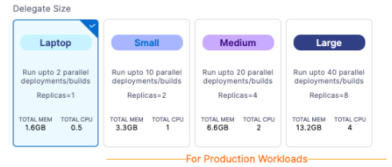

This topic lists the requirements for Harness Delegate.

## Important notes

Note the following important information about delegates:

* Deployment limits are set by account type.

* You might need to install multiple delegates depending on how many continuous delivery tasks you do concurrently, and on the number of compute resources you provide to each delegate. Typically, you need one delegate for every 300 to 500 service instances across your applications.  

	A service instance is created when you use Harness to deploy the underlying infrastructure for the instance.  

	For example, an instance of a Kubernetes workload where Harness creates the pods, or an instance of an ECS task where Harness creates the service for the task.

* The delegate is installed in your network and connects to the Harness Manager.

  
  
  The requirements for memory and CPU support only the delegate. The delegate host, pod, and container require additional compute resources to support other operations, systems, and services such as Docker or Kubernetes.

  The delegate runs in a Linux/UNIX container.

* The minimum memory for the delegate must be provided in addition to enough memory for the host/node system. For example, an AWS EC2 instance type such as m5a.xlarge has 16GB of RAM; 8 for the delegate and 8 for the remaining operations.

* The Shell Script delegate requires cURL 7.64.1 or later.

* Access to artifact servers, deployment environments, and cloud providers is required, as shown in the following illustration:

## Allowlist Harness domains and IPs

Harness SaaS delegates only need outbound access to the Harness domain name, most commonly, **app.harness.io**, and optionally, to **logging.googleapis.com**. The URL **logging.googleapis.com** is used to provide logs to Harness Support.

Go to [Allowlist Harness Domains and IPs](/docs/platform/20_References/whitelist-harness-domains-and-ips.md).

## Network requirements

The following network requirements are for connectivity between the Harness delegate you run in your network and the **Harness Manager** (SaaS or on-prem), and for your browser connection to the Harness Manager.

:::note
All network connections from your local network to Harness SaaS are outbound-only.
:::

All network connections from your local network to Harness SaaS are outbound-only.* HTTPS port 443 outbound from the Delegate to Harness.
* Delegate requirements: The Delegate will need API/SSH/HTTP access to the providers you add to Harness, such as:
	+ Cloud Providers.
	+ Verification Providers.
	+ Artifact Servers (repos).

	+ Source repositories.
	+ Collaboration providers
	+ SSH access to target physical and virtual servers

### gRPC limitations

If you do not enable gRPC connections, the following limitations apply:

* [Cloud Cost Management (CCM)](/docs/category/cloud-cost-management) does not collect events. 

## Add certificates and other software to the delegate

For steps on adding certificates or other software to the delegate, go to [Common delegate initialization scripts](/docs/platform/2_Delegates/delegate-reference/common-delegate-profile-scripts.md).

## Delegate access requirements

Harness delegate does NOT require root account access, but the Kubernetes and Docker delegates run as root by default. If you do not need to install applications using Delegate Profiles, then you can use a non-root account or install the application without the delegate.  

For more information, see [Delegate installation overview](/docs/platform/2_Delegates/get-started-with-delegates/delegate-installation-overview.md).

* Delegates do not require root account access. Kubernetes and Docker delegates do, however, run as root by default. If you do not need to install applications during the initialization process (`INIT_SCRIPT`), you can use a non-root account or install the application without the delegate.  
See [Delegate installation overview](/docs/platform/2_Delegates/get-started-with-delegates/delegate-installation-overview.md).
* If you do not run the delegate as root, you cannot use [delegate initialization scripts](/docs/platform/2_Delegates/delegate-reference/common-delegate-profile-scripts.md) to install software.

