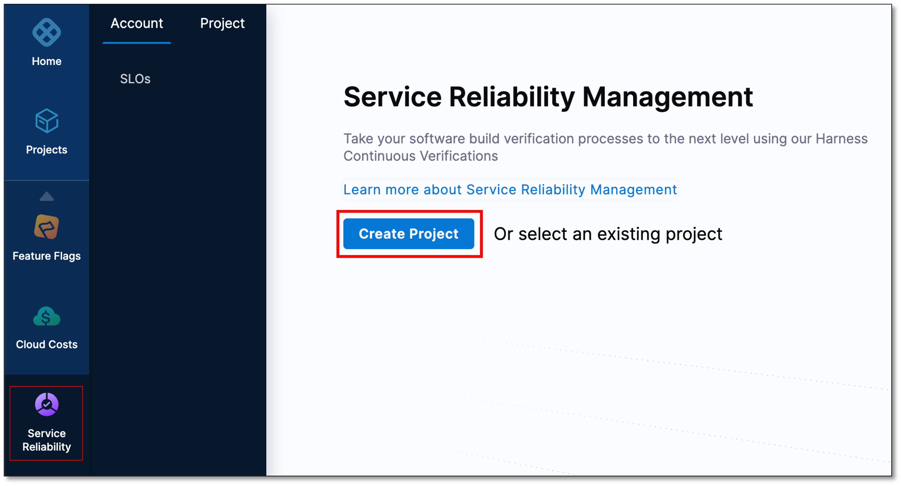
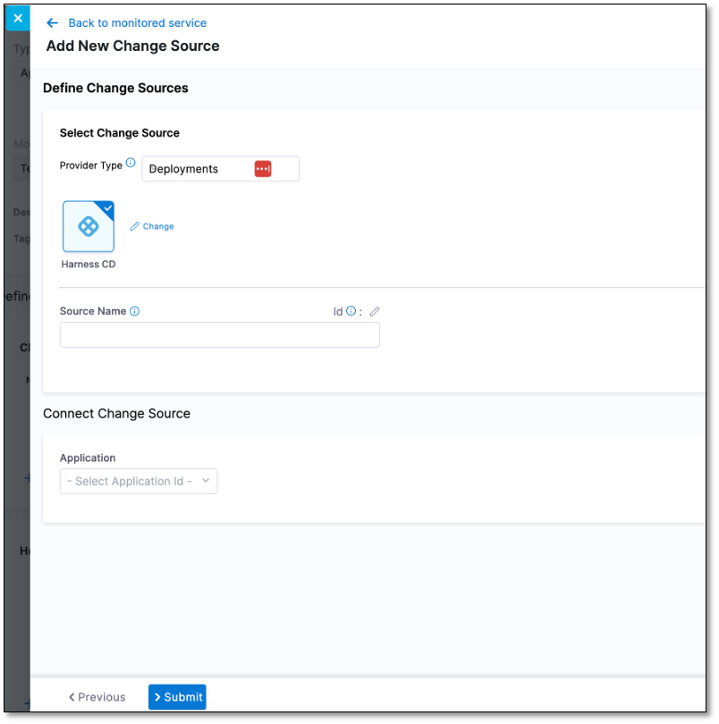
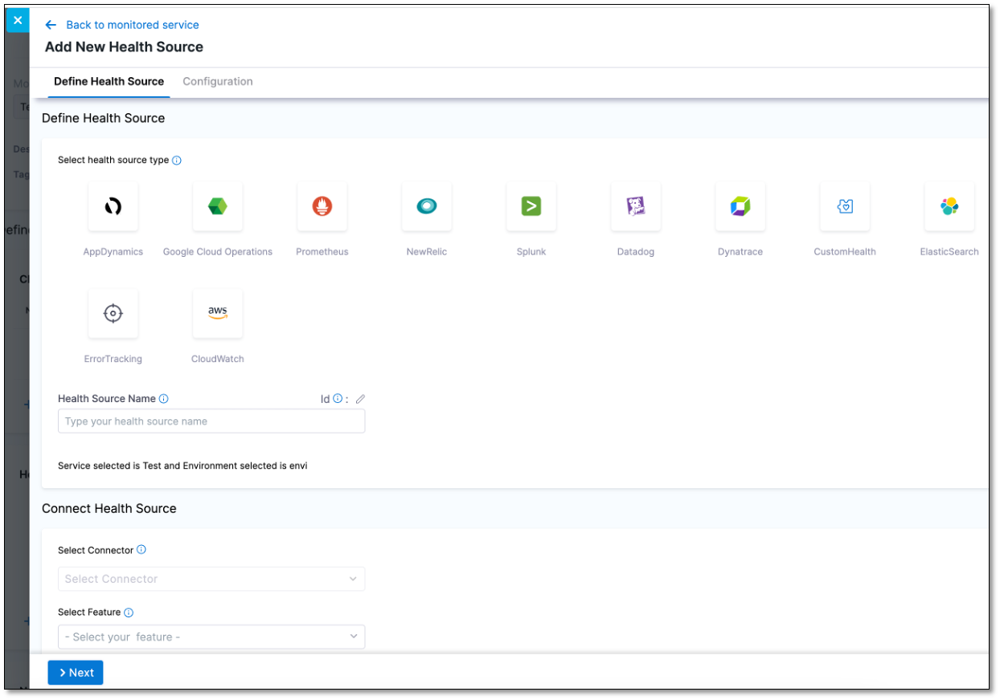

This topic describes how to create a monitored service to correlate change events.

## Prerequisites

- Ensure that you have installed a Delegate and it can communicate with Harness, the health source, and the change source. To learn more about delegates, go to [Get started with delegates](https://developer.harness.io/docs/category/delegate-concepts).
- Create an organization if you have not already created one. To learn more about organizations in Harness, go to [Create organizations and projects](https://developer.harness.io/docs/platform/organizations-and-projects/create-an-organization).

## Create a project
To create a project, perform the following steps:

1. In Harness, select **Service Reliability** > **Create Project**.
   
2. On the **About the Project** page, do the following, and then select **Save and Continue**: 
   - **Name**: Enter a name for the project.
   - **Color**: Select a color theme for the project.
   - **Organization**: Select an organization for the project. If you don't yet have an organization in Harness, and want to learn how to create one, go to [Create a Harness Org](https://developer.harness.io/docs/platform/organizations-and-projects/create-an-organization#step-1-create-a-harness-org).
3. On the **Invite Collaborators (Optional)** page, in the **Invite People to Collaborate** field, add team members to the project.
4. In the **Role** field, assign a role to the collaborators.
5. Select **Add**.
6. Select **Save and Continue**.  
   Your project is created.

## Create a monitored service

A monitored service is a logical entity that combines a Harness service and environment. The service could be a microservice or any other workload that can be monitored. Environments represent your deployment targets such as QA, prod, and so on.

The following steps explain how to create a monitored service in Harness.

### Navigate to the "Create new monitored service" page

To create a monitored service:

1. In your Harness project, navigate to the **Service Reliability** module, and then select **Monitored Services** > **+ New Monitored Service**.

The Create new monitored service page appears.

### Define the monitored service

1. In the **Overview** section, enter the following information:
    * **Type**: Select **Application**.
    * **Create or select a Service**: Do one of the following:
     
       * If the service that you want to monitor exists, select it.
       * If you want to create a service, select **+ Add New**, enter the following information, and then select **Save**. 
       
          *  **Name**: Enter a name for the service. For example, _sample_service_.
          *  **Description (Optional)**
          *  **Tag (Optional)** 
           
    * **Create or select an Environment**: Do one of the following:
     
       * If the environment that you want to monitor exists, select it.
       * If you want to create an environment, select **+ Add New**, enter the following information, and then select **Save**. 
       
          *  **Name**: Enter a name for the environment.
          *  **Description (Optional)**
          *  **Tag (Optional)** 
          *  **Environment Type**: Select an environment type. The available options are **Production** and **Non-Production**.

    Harness autopopulates the **Monitored Service Name** field by combining the service and environment names. This field is not editable.

### Add a change source

A change source monitors change events related to deployments, infrastructure changes, and incidents.  

In the **Change Sources** section, you can either edit an existing change source or create a new one.
 
To create a new change source, do the following:

1. Select **+ Add New Change Source**.  
   The Add New Change Source dialog appears.

     

2. In the **Provider Type** dropdown list, select the change source. Following are the available options:  

    - **Deployments**: You can choose **Harness CD NextGen** or **Harness CD**. 
    - **Incident**: Select the incident management tool that monitors your application.

3. In the **Source Name** field, enter a name for the change source.
4. In the **Application** dropdown list, select an application ID. This field is available if you select Harness CD in **Provider Type**.

The new change source appears in the **Change Sources** list.

### Add a health source

A health source monitors the health trends of the monitored service using logs or metrics collected from an Application Performance Monitoring (APM)or logging tool.

To add a new health source, do the following:  

1. Select **+ Add New Health Source**.  
   The Add New Health Source dialog appears.

   

2. In the **Select health source type** section, select the health source that monitors your service.
   
3. In the **Health Source Name** field, enter a name for the health source.
   
4. In the **Connect Health Source** section, do the following:
   1. **Select Connector**: Select a existing connector. Connectors contain the information that is necessary to integrate and work with your health source.
   2. **Select Feature**: Select the feature associated with the health source. The available features depend on the health source that you select. For example, if you select **SumoLogic**, the **SumoLogic Cloud Metrics** and **SumoLogic Cloud Logs** features become available. 

5. Select **Next**.
   
6. On the **Customize Health Source** tab, configure the health source settings. The settings that are displayed depend on the health source that you select in the **Define Health Source** tab.
   
   For example, if you select AppDynamics as the **Health Source Type**, then the following settings are displayed:

   - **Find an AppDynamics application**: Displays a list of applications associated with AppDynamics. Select the application you want.
   
   - **Find an AppDynamics tier**: Displays a list of tiers associated with the selected application. Select the application tier you want.
   
   - In the **Metrics Packs** section, select the metrics that you want to use for the health source. The options available are **Errors** and **Performance**.

    
   
7. Select **Submit**.  
   The new health source appears in the **Health Sources** list.
   
8.  In the upper-right corner select **Save**.  
    You can view the new monitored service in the **Monitored Services** list.

   

## Next steps

